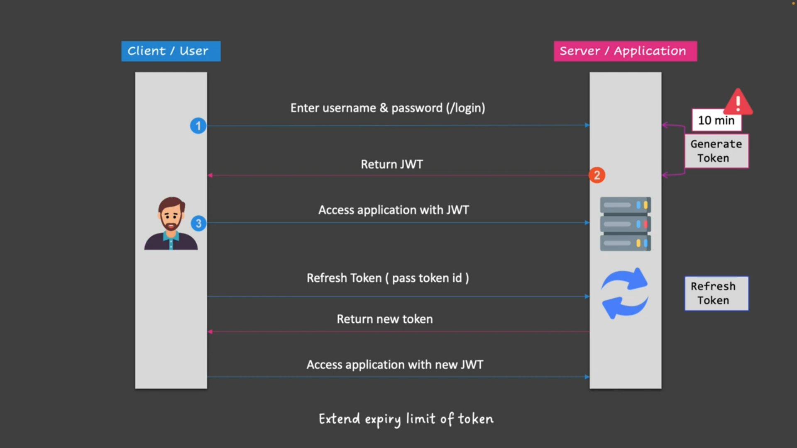
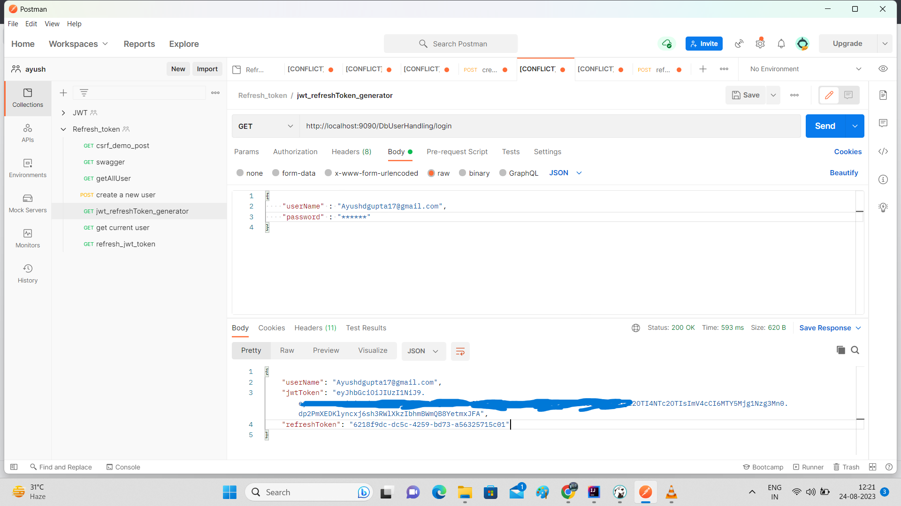

### JWT With Refresh Token
1. Usually when we create an application with a security using JWT, a client needs to provide his userName and
   password to authenticate and authorize himself and after authentication we generate one 'JWT Token' and provide
   it to the client so there is no need for user to authenticate himself again and again using userName and password,
   everytime whenever he will try to accesss any other resource from our app then that Jwt Token will be used and
   accordingly the necessary steps will be taken like redirecting the user to his destination or throwing an error
   if Token is wrong etc.
2. But there is a problem with JWT that it has a expiration limit i.e. during the generation of JWT we set the 
   expiration time of the JWT for e.g. 5 min. so if a user logged into our app at 10:15 am then the JWT will be valid
   10:20 am after that if user will try to access any other service then he will get an error because the JWT is
   expired now so user has to log in again into our system and then he can complete his work but suppose if a user is
   doing some important work, and he needs to save that work but at that time only our JWT expire and the user lost his
   entire work then it'll be treated as a flaw in our application.
3. So to handle such kind of situation we use refresh token, refer below diagram -

4. **Refresh Token** is a random token that we will generate along with the JWT Token for a user when he will try to
   login into our system.
5. After generating the refresh token we will save this token on our side and send it to the user along with the JWT
   token i.e. our response will be like -

6. Sending userName is optional.
7. So now at the UI side we have both the things available JWT and RefreshToken so whenever the JWT Token will
   expire then from the UI side we will get a request along with the refresh token to refresh the JWT token because
   JWT is expired but client still wants todo some work, so we will also expose one endpoint which will accept the
   refresh token and generate a new JWT and send it back to the user.
8. But one more point is refresh token also have some expiration time limit so whenever we will get the request to
   refresh the JWT token we will also check the expiration time of the refresh token, if valid then only we will
   refresh the JWT otherwise **NO**.

## Extra point during RefreshToken Implementation
1. Never used **'httpBasic' or 'formLogin'** when using JWT Authentication because it'll override the JWT part, it'll
   allow you to access resources based on userName and password only.
2. When I was trying to delete the older refresh token from DB table using custom finder methods **'findBy()'** then
   I need to apply that on the column which was mapped using @OneToOne annotation so to apply custom finder method on
   that column we need to follow below rules -
   1. If we are applying findBy on a single column then form the method using **'findBy + variable name + refrenced
      column name'** for e.g. -
   ```
   Column -
   @OneToOne
   @JoinColumn(name = "userId", referencedColumnName = "userName")
   private UserSecurityInfo userSecurityInfo;
   
   Method Name -
   RefreshTokenSecurity findByuserSecurityInfoUserName(String userName);   
   // in above variable name will be use as it is i.e. in userSecurityInfo 'u' is small not capital.
   ```
   2. But when findBy will be used in combination with other column then first letter (e.g. 'U') will be capital i.e.
      follow the camel casing.
   ```
   Columns
   private String refreshToken;
   
   @OneToOne
   @JoinColumn(name = "userId", referencedColumnName = "userName")
   private UserSecurityInfo userSecurityInfo;
   
   Method Name -
   Optional<RefreshTokenSecurity> findByRefreshTokenAndUserSecurityInfoUserName(String refreshToken, String userName);
   ```